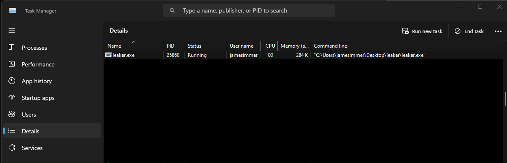
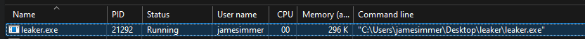
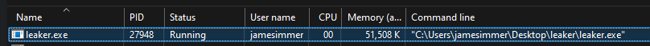
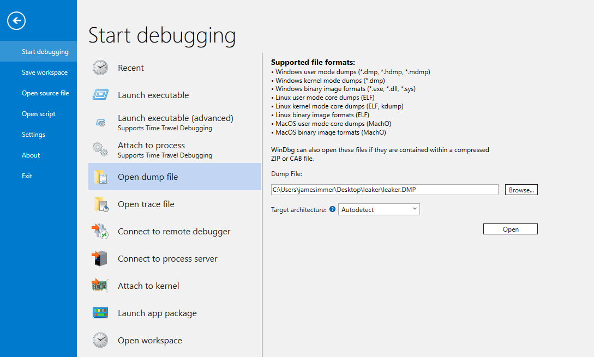
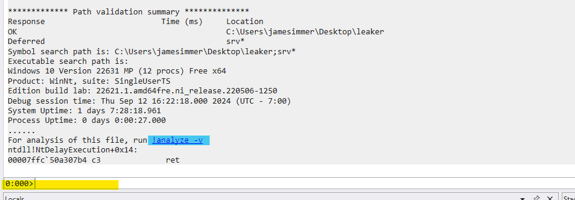

Learn WinDBG

**Table of Contents**
- [Setup WinDBG](#setup-windbg)
- [Memory Leak](#memory-leak)
  - [Compiling](#compiling)
  - [Creating a memory dump](#creating-a-memory-dump)
  - [Analyzing the memory dump](#analyzing-the-memory-dump)

<br>

---

<br>

This will go over how to:
- Take a memory dump of a process in Window
- Analyze the dump with WinDBG
- Compile and use C code that can reproduce the behavior


## Setup WinDBG

- Download WinDBG [here](https://aka.ms/windbg/download).
- Once done, open it by searching for it in windows.
- Now we need to initialize the symbols for Windows binaries, `.symfix+ C:\Symbols` will achieve this for us.
> It will download all the default symbols from Microsoft's public Symbols server. This should work for ALL windows services, or uses of the Windows SDK. Any 3rd party modules or libraries will need their own Symbols imported. Under `C:\Symbols` you will see directories containing the publicly provided `.pdb` files.
- Then reload using `.reload -f`


## Memory Leak

For this test, we will be using `leaker-win.c`, which can be found [here](./leaker/leaker-win.c). **This will allocate 50 Mbs of memory, then loop sleep until the program is closed.**

### Compiling

> A pre-compiled version of the program, `leaker.exe`, can be found [here](./leaker).

Use WSL or Linux in a VM to compile using `zig cc` 

```bash
zig cc leaker-win.c --target=x86_64-window -o leaker.exe
```
This will generate a `.exe` and `.pdb` file. The `.exe` is our binary containing the leaker app, where the `.pdb` file contains debug information for the app like symbols and addresses.

> In many cases, the `.pdb` file generated from compilation time will be needed for debugging. However, for this simple application, it will not provide any additional information than the [publicly available Symbols provided by Microsoft](https://learn.microsoft.com/en-us/windows/win32/dxtecharts/debugging-with-symbols?redirectedfrom=MSDN#using-the-microsoft-symbol-server) would.


### Creating a memory dump

Now that we have the binary executable. We can run it and take a memory dump. There are many ways to do this. For this tutorial, we will use the feature built into Task manager.

1. Execute program `leaker.exe`.
2. Open Task manager, and goto 'Details' on the left hand bar.
3. Once there, you should be able to find the program under the name 'leaker.exe'



> You'll notice that the memory utilization of the application shows 284Kb, instead of the 50 Mbs mentioned earlier. This is expected behavior. 
> 
> Due to how Windows pages in and out virtual memory for the application, only 284Kbs of data is actually stored in ram at this moment. Once we create the dump, Windows will move all the allocated data to physical memory, then capture the data we need.
> 
> 


4. Now right-click on the process and select 'Create memory dump file'. This will create a pop-up once finished that contains our dump. **Please note this location.**

> Now that the dump has been created, we can see the full amount of memory the app is consuming.
> 
> 

We now have the memory dump in hand. We can stop the process in any method that works best for you. This could be either pressing 'Control-C' on the program's CMD window, or terminating the program via Task Manager.


### Analyzing the memory dump

Assuming you followed the setup for WinDBG, then no further setup is needed.

1. Load the newly created `.DMP` dump file into WinDBG
   - *FIle > Open dump file > Input path to .dmp > select Open*



2. Once loaded, the Window should populate a bit of text. We want to run an analysis over the dump. To do this, we can either **(A)** select the `!analyze -v` hyperlink or **(B)** type the same into the command line below.



